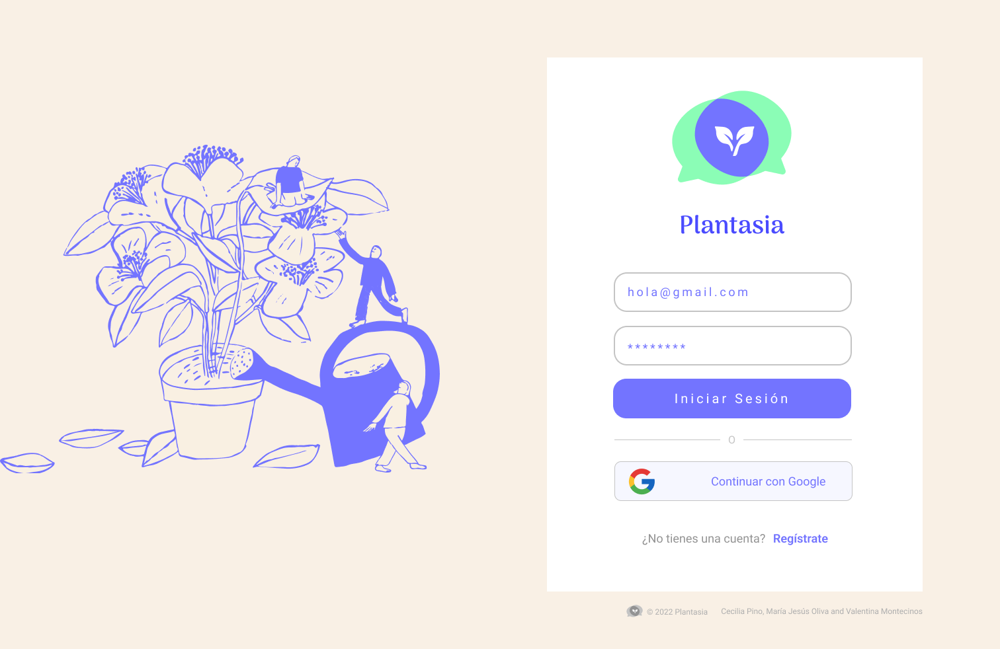
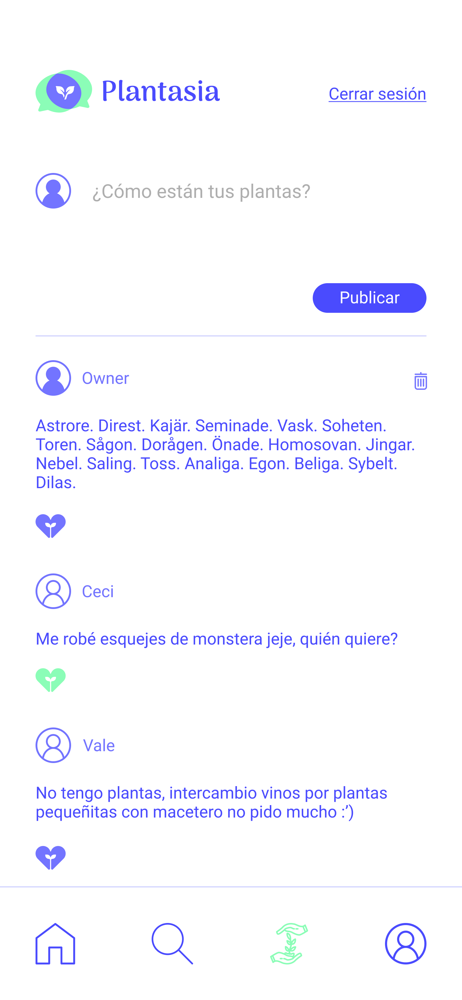
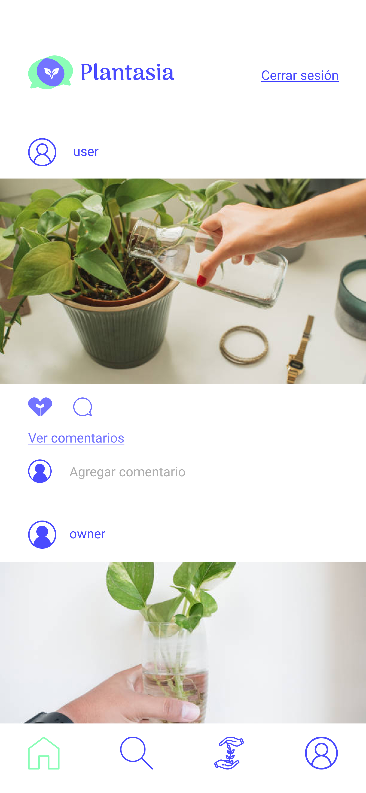
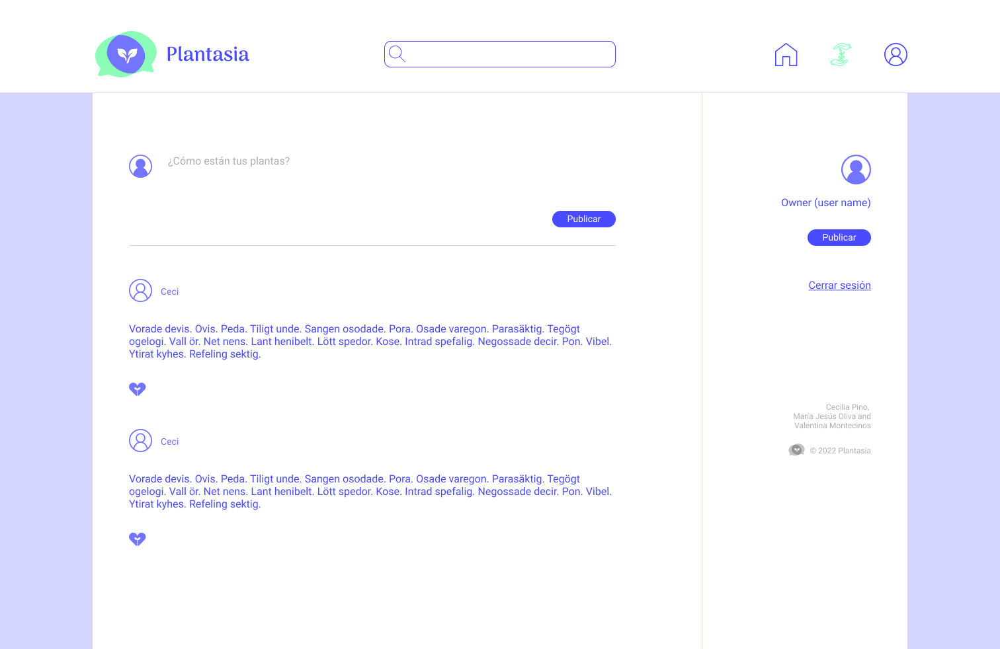
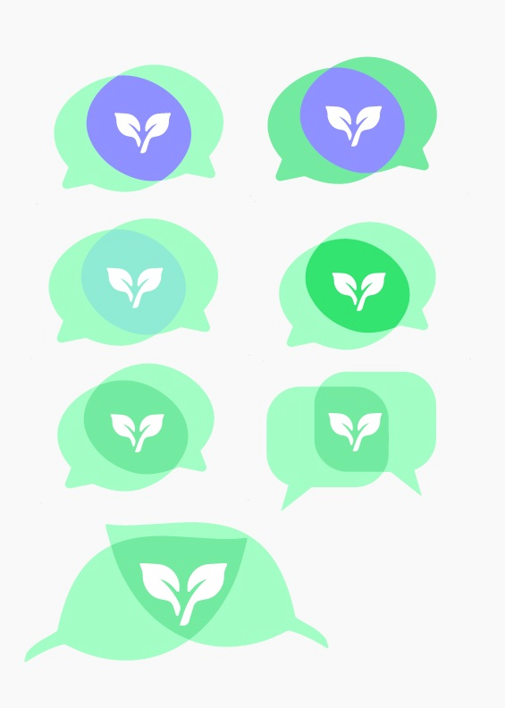
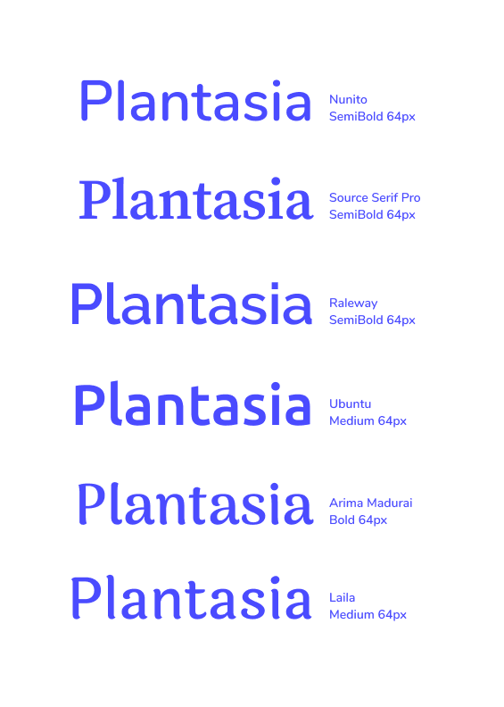

 
****

[Ir a Plantasia](src/index.html)

Plantasia es una red social orientada a conectar a personas amantes de las plantas, en un espacio dedicado específicamente al tema. La forma en la que Plantasia resuelve esta necesidad es a través de la posibilidad que da al usuario de publicar contenido, dar y recibir likes e incluso editar o borrar sus publicaciones. Así, nuestros usuarios podrán compartir dudas, consejos o simplemente actualizaciones respecto al estado de sus plantas. 

## Índice

* [1. Hallazgos](#1-hallazgos)
* [2. Historias de Usuario](#2-historias-de-usuario)
  * [2.1 HU1](#2.1-hu1)
  * [2.2 HU2](#2.2-hu2)
  * [2.3 HU3](#2.3-hu3)
* [3. Proceso de diseño](#3-proceso-de-diseño)
* [4. Tecnologías](#4-tecnologías)

## Hallazgos

La temática de nuestro proyecto la determinamos definiendo 3 propuestas iniciales, para luego decidir la opción que desarrollaríamos.  Encuestamos a un grupo de alrededor de 40 personas, quienes escogieron la opción de desarrollar una red social de plantas. 

<!-- Con este input editamos nuestra primera historia de usuario añadiendo el diseño del logo de inicio y escogiendo una paleta de colores. -->

## Historias de Usuario

### HU1

En nuestra primera Historia de Usuario definimos la vista de registro de cuenta, investigando e implementando las funcionalidades de Firebase de crear usuario de forma manual o con una cuenta de Google.

### HU2
En la segunda Historia de Usuario definimos la vista de inicio de sesión, nuevamente investigando e implementando las funcionalidades de Firebase para iniciar sesión de forma manual, y/o utilizando la autenticación a través de una cuenta de Google. 

 

### HU3

En nuestra tercera Historia de Usuario definimos la vista del muro en el cual se desplegan los posts de los usuarios. En nuestro prototipo de baja fidelidad aparecen post con texto y con imágenes, con botones para dar "me gusta" y comentar en cada post. En esta historia de usuario desarrollamos las funcionalidades de escribir un nuevo post, y que estos de desplieguen con el nombre de usuario, y que los posts aparezcan del más reciente al más antiguo. Además, añadimos el botón de "me gusta" y el contador de estos, con las condiciones de un "me gusta" por usuario en un post.

Una de las restricciones añadidas a través del ruteo de flujo de nuestra página web fue la de poder acceder al muro solo si el usuario ha iniciado sesión. 

## Proceso de diseño

## Tecnologías